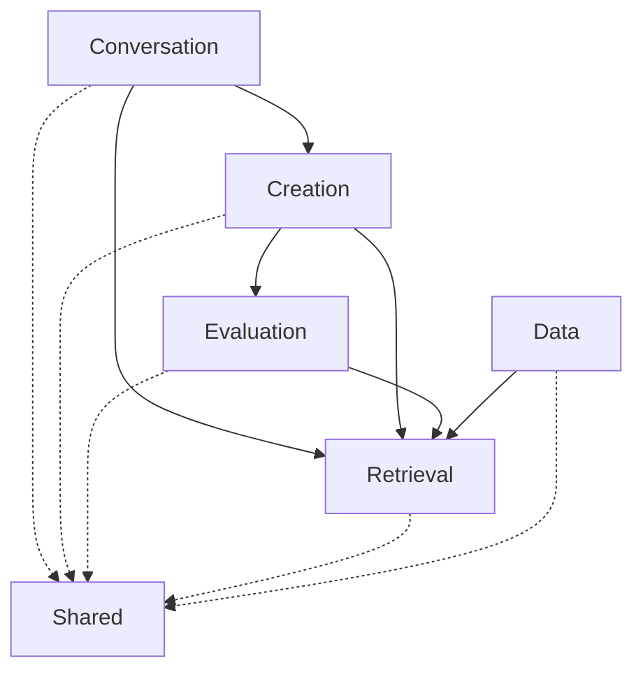

# ADR-001: 采用模块化单体架构

## 状态
已接受

## 上下文

《众生界》项目当前是一个单机AI小说创作辅助系统，具有以下特征：

1. **团队规模**: 1-2人开发维护
2. **部署环境**: 本地单机运行
3. **用户规模**: 单用户创作
4. **开发节奏**: 快速迭代，每周多次更新
5. **运维能力**: 有限的运维资源

我们面临架构选型的决策：采用微服务架构还是单体架构？

### 考虑过的选项

| 选项 | 优点 | 缺点 |
|------|------|------|
| 微服务架构 | 独立扩展、技术异构、团队自治 | 运维复杂、分布式事务、调试困难 |
| 单体架构 | 开发简单、测试容易、部署快速 | 扩展受限、技术锁定、代码耦合 |
| 模块化单体 | 兼顾两者优点 | 需要严格的模块纪律 |

## 决策

采用**模块化单体架构（Modular Monolith）**。

具体设计原则：

1. **清晰的模块边界**: 每个限界上下文（Bounded Context）对应一个独立的Python包
2. **显式接口**: 模块间通信通过定义的接口，禁止直接访问内部实现
3. **依赖方向**: 依赖关系必须指向核心领域，禁止循环依赖
4. **未来就绪**: 模块设计时预留未来拆分为独立服务的接口

## 模块划分

```
core/
├── conversation/          # 对话上下文 - 用户交互入口
│   ├── __init__.py
│   ├── conversation_entry_layer.py
│   ├── intent_classifier.py
│   └── ...
├── creation/              # 创作上下文 - 场景创作核心
│   ├── __init__.py
│   ├── scene.py
│   ├── writer.py
│   └── ...
├── evaluation/            # 评估上下文 - 质量评估
│   ├── __init__.py
│   ├── evaluator.py
│   └── ...
├── retrieval/             # 检索上下文 - 数据检索
│   ├── __init__.py
│   ├── unified_retrieval_api.py
│   └── ...
├── data/                  # 数据上下文 - 数据管理
│   ├── __init__.py
│   ├── change_detector/
│   ├── type_discovery/
│   └── ...
└── shared/                # 共享内核 - 通用工具
    ├── __init__.py
    ├── config_loader.py
    └── ...
```

## 接口契约示例

```python
# core/creation/interfaces.py
from abc import ABC, abstractmethod
from typing import List, Dict

class WriterPort(ABC):
    """作家接口 - 创作上下文对外暴露的能力"""
    
    @abstractmethod
    def get_specialty(self) -> List[str]:
        """获取作家专长维度"""
        pass
    
    @abstractmethod
    def compose(self, context: Dict) -> str:
        """执行创作"""
        pass

class SceneRepository(ABC):
    """场景仓储接口 - 数据访问抽象"""
    
    @abstractmethod
    def save(self, scene: 'Scene') -> None:
        pass
    
    @abstractmethod
    def find_by_id(self, scene_id: str) -> Optional['Scene']:
        pass
```

## 依赖规则



**规则说明**:
- 实线箭头: 业务依赖
- 虚线箭头: 共享内核依赖
- 禁止任何反向依赖
- 禁止跨层依赖

## 后果

### 积极的后果

1. **开发效率**: 单体部署，无需处理分布式系统的复杂性
2. **测试简单**: 集成测试在单进程内完成
3. **调试容易**: 可以单步跟踪整个创作流程
4. **事务简单**: 数据一致性在进程内保证
5. **演进灵活**: 未来可以平滑拆分为微服务

### 消极的后果

1. **扩展限制**: 无法独立扩展特定模块（如向量检索）
2. **技术锁定**: 整个系统必须使用相同技术栈
3. **部署粒度**: 任何修改都需要全量部署
4. **模块纪律**: 需要严格的代码审查确保模块边界

## 缓解措施

针对消极后果的缓解策略：

| 问题 | 缓解措施 |
|------|----------|
| 扩展限制 | 向量检索层设计为可独立扩展，预留分片接口 |
| 技术锁定 | 通过接口抽象，允许特定模块使用不同实现 |
| 部署粒度 | 建立完善的自动化测试，降低部署风险 |
| 模块纪律 | 使用import-linter工具强制检查依赖规则 |

## 验证

使用以下方法验证架构合规性：

```bash
# 检查循环依赖
pip install import-linter
lint-imports

# 检查模块边界
python -c "
from core.creation import Writer  # OK
from core.conversation import IntentClassifier  # OK
from core.retrieval import TechniqueSearch  # OK
# from core.creation.writer import _private_func  # 应该失败
"
```

## 相关决策

- ADR-002: 使用Qdrant作为向量数据库
- ADR-004: 插件化扩展机制

## 备注

此决策将在以下条件下重新评估：
- 用户规模超过10人同时使用
- 需要支持云端多租户部署
- 特定模块（如向量检索）成为性能瓶颈

---

**创建日期**: 2026-04-13  
**创建者**: 软件架构师  
**最后更新**: 2026-04-13
